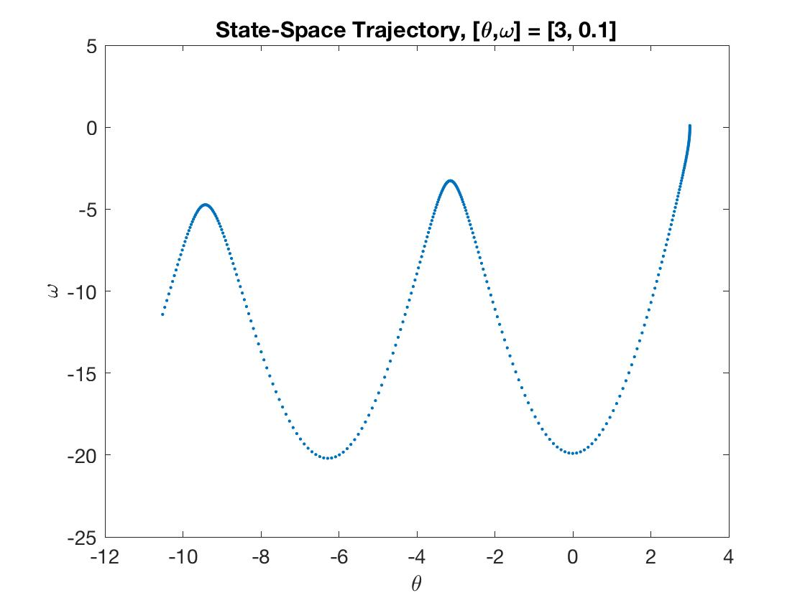
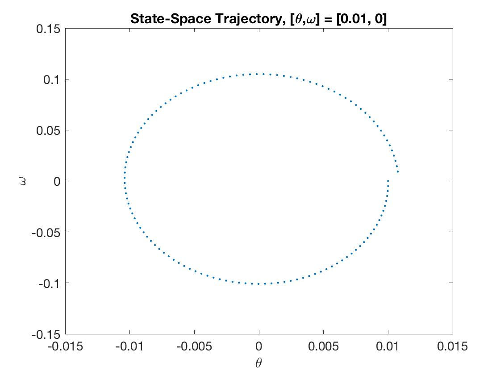
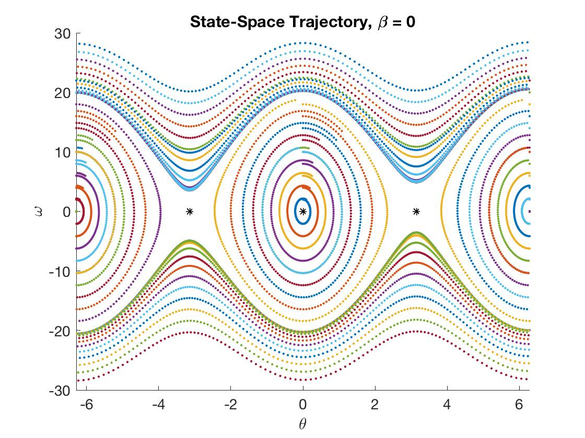
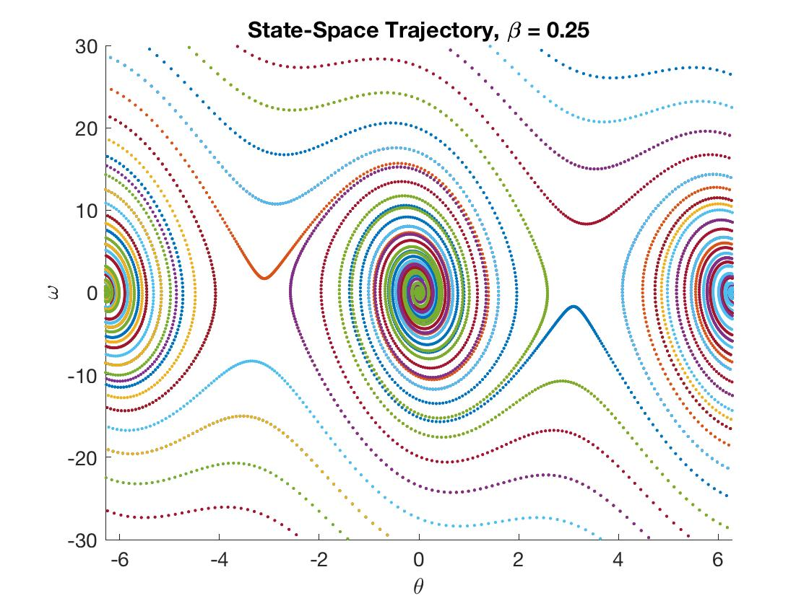
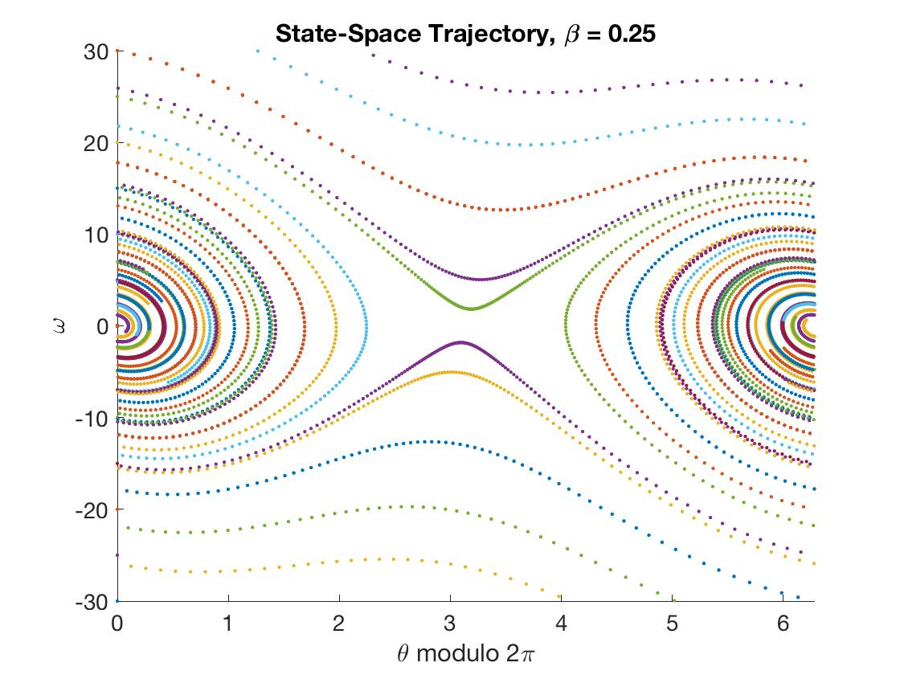
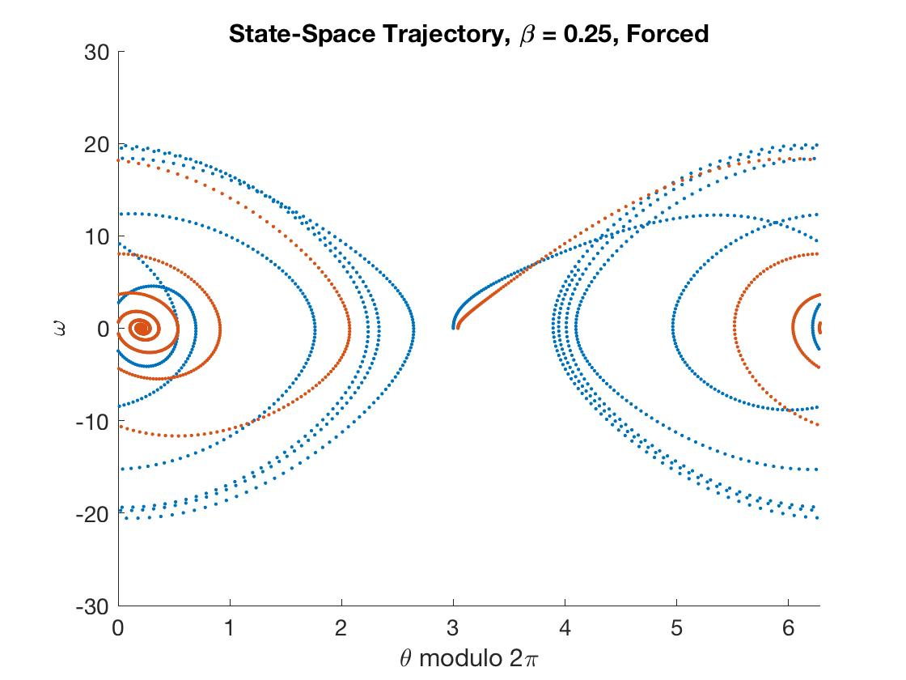
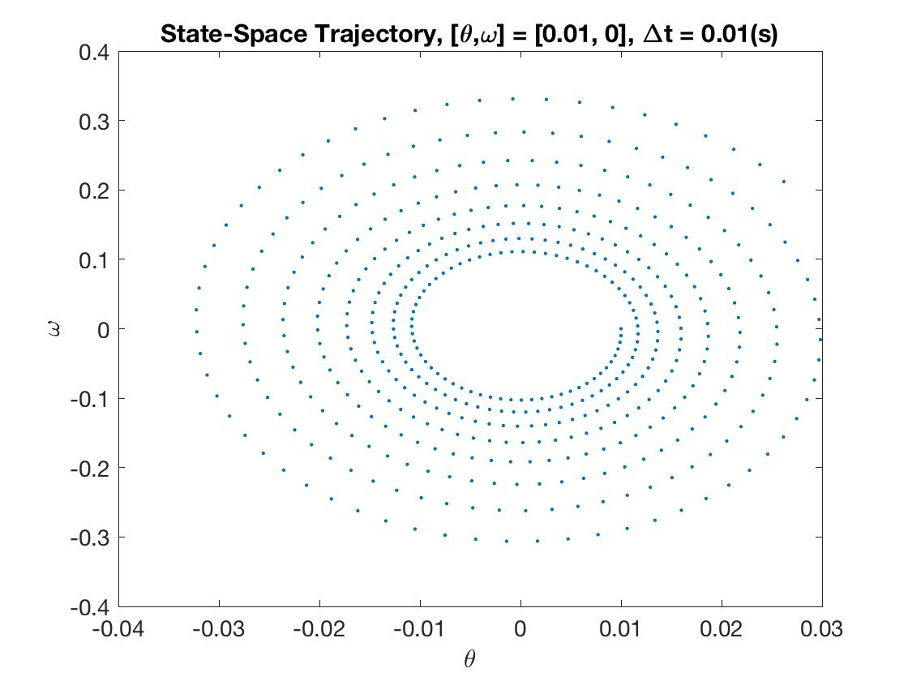
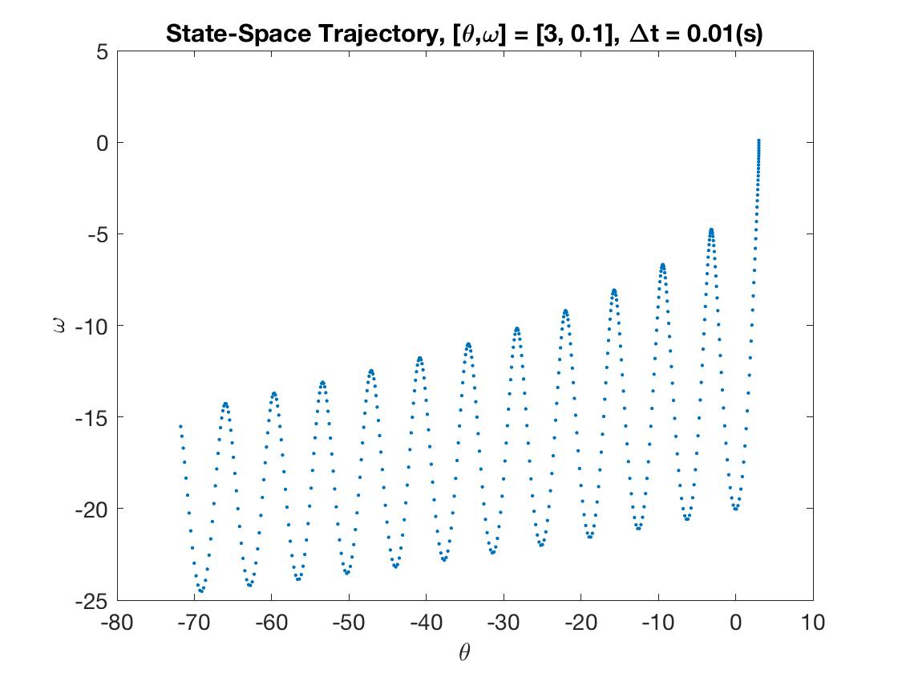
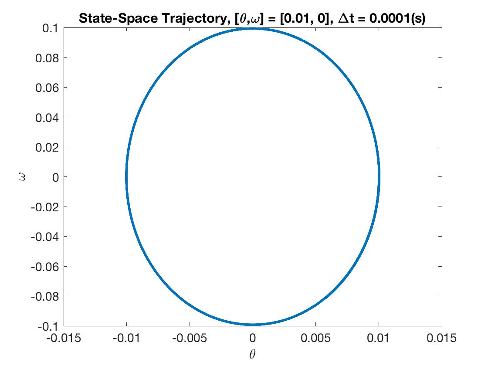
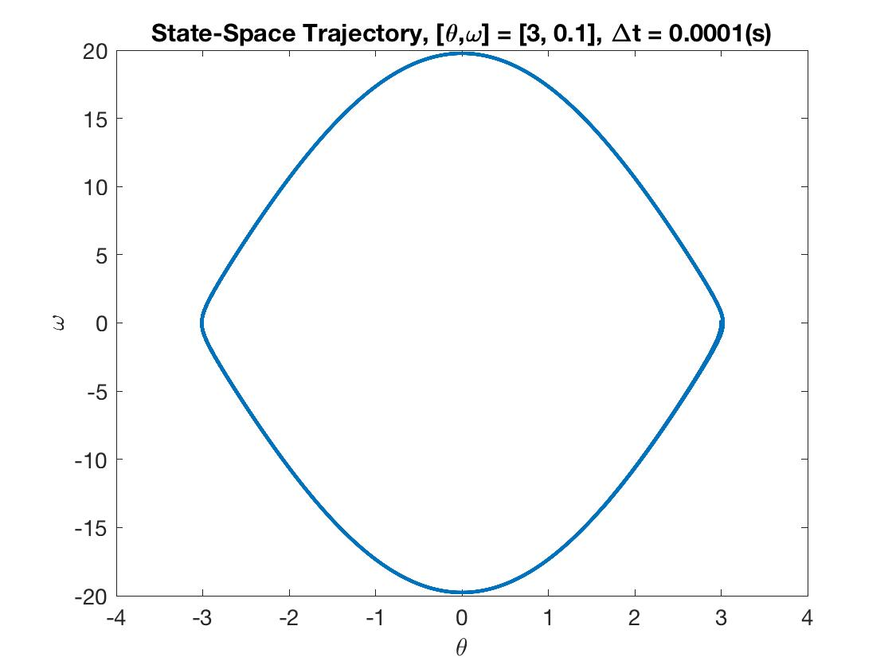

# Chaotic Dynamics - Analysis of a Pendulum using 4th Order Numerical Intergrator

Utilizing a fourth-order Runge-Kutta numerical integrator, the non-linear equation of motion for a forced, damped pendulum was modeled. The equations governing such motion are as follows:  

$$
    ml \ddot{\theta}(t) + \beta l \ddot{\theta}(t) + mg\sin\theta(t) = A\cos(\alpha t)
$$ 

This second-order differential equation was then broken into two first-order differential equations by the use of a substitution of variables. These first order differential equations are needed when solving for the coefficients, $k_n$, for the fourth-order Runge-Kutta method. These first-order differential equations are given as follows:  

$$
    \dot{\theta}(t) = \omega(t)
$$
 

$$
    \dot{\omega}(t) = \frac{\beta}{m}\omega(t) + \frac{g}{l}\sin(\theta(t)) + A \cos(\theta(t))
$$

These two system derivatives were then implemented into the the fourth-order Runge-Kutta method as follows:  

$$
    \vec{k_1} = h\vec{f}(\vec{x})
$$
 

$$
    \vec{k_2} = h\vec{f}(\vec{x} + \frac{1}{2}\vec{k_1})
$$
 

$$
    \vec{k_3} = h\vec{f}(\vec{x} + \frac{1}{2}\vec{k_2})
$$
 

$$
    \vec{k_4} = h\vec{f}(\vec{x} + \vec{k_3})
$$
 

$$
    \vec{x}(t_0 + h) = \vec{x}(t_0) + \frac{1}{6}(\vec{k_1} + 2\vec{k_2} + 2\vec{k_3} + \vec{k_4})
$$
 

Where the system derivatives are represented by $\vec{f}$. The ordering is important as the variables all depend on each other. For this reason the state variable, $\vec{x}$, represents $[\theta,\omega]$. 

## Numerical Analysis Using 4th Order Runge-Kutta Numerical Intergrator

### Part a.)
Utilizing the fourth-order Runge-Kutta numerical integrator created for problem 1, the following plots where calculated using the inputs: $m = 0.1$(kg), $l = 0.1$(m), $\beta = 0$, $\alpha = 0$(rad), $A = 0$, $\Delta t = 0.005$(s), $[\theta,\omega] = [3, 0.1]$.  

 
 

The initial conditions for the state variables were near an unstable equilibrium point, $[\pi,0]$. Since these initial conditions were not exactly at the unstable fixed point, the system continuously moved away from this point. Interestingly, even with $\beta = 0$, the system has a noticeable damping effect from the numerical solver as can be seen by the system slowing emanating outward, as if it has positive damping ($-\beta$, not physical).  

### Part b.)
The same constants were used as in part (a), with respect to the pendulum. The initial conditions were altered to $[\theta,\omega] = [0.01, 0]$. The following plots were then calculated:  

 
 

As can be seen from the plot, a more elliptical plot was formed. The plot is more elliptical due being close to the stable fixed point, $[0,0$. Since the angular velocity is smaller, the system stays about its elliptical orbit. The slight positive damping effect from the numerical integrator is once again seen as the ellipse is growing in size.  

## State Space Portrait
Creating a state-space portrait of the pendulum with zero damping gives the following results:

 
 

The phase portrait depicts the fixed points with black stars. The neutrally stable fixed point at the center of the plot has elliptical orbits slowly getting larger as they emanate from the center. These ellipses reach a point where the initial conditions create new hyperbolic trajectories.  

When repeating the same procedure, but with the damping term set to - $\beta = 0.25$, the system is seen to spiral inward to the stable fixed points. This is plotted below:  

 
 

The plots suggest that the dissipative damping term has the effect of making the system converge to stable fixed points as we would expect. Since a pendulum is a dissipative systems, this gives intuitive results since we expect the system to converge to the point $[0,0]$. The stable fixed point is now an attractor and the three different stable fixed points depicted in this plot represent initial conditions that caused the pendulum to spin a full revolution or more around the center and then as the system looses angular velocity to friction, converge to a fixed point. If the dissipative term, $\beta$, was increased, the system would converge more quickly to the stable fixed points. The initial conditions that would cause a full revolution around the center may also converge before the full revolution, now that the system has more damping. If $\beta$ were decreased, it would take longer for the trajectories to converge, where some of the initial conditions with higher $\omega$ terms may converge at higher $\theta$ stable fixed points as more revolutions around the center occur.  

## Bounding Multiples of $\theta$
Applying a modula function so that all values of $\theta$ lie within the range $[0,2\pi]$, give the following plot:

 
 

Since the same number of points are now distributed into a smaller region, much less iterations are needed for each initial condition.  

## Adding Non-Zero Forcing Input
When the amplitude of the forcing term is made non-zero, the behavior of the dynamics changes. When the amplitude of the driving force is increased, the effect on the trajectory changes more and more noticeably. At first, changes were only seen near the stable fixed point, where the effects don't change the overall structure of the system. As the amplitude was increased, the system became noticeably chaotic as the structure changed and the patters no longer repeated. This change in the dynamics with the parameter, $A$, is known as a bifurcation.  

 
 

This plot show that the system is indeed chaotic as small changes in initial conditions drastically change the trajectory. The system is seem to have similar structure (pattern), but this structure never actually repeats.  

## Time Step Effect on Numerical Approximation
The time step was changed to see the effects on the system. The initial conditions from the plots for question 2 were used to compare the effects that the time step has. The following plots were obtained:  

  
 

  
 

These plots show that my intuition for question 2 were correct when I assumed that the numerical solver must have been effectively damping the systems. This damping is further shown by the top plots where the system reacts in a very similar way to when there is a damping term, $\beta$, that is greater than zero. This correlates to a time step that is too large, so the system is jumping too far when making local estimates on the slope, to further calculate the next step in the Runge-Kutta numerical solver. The bottom plots correlate to a smaller time step, which effectively give more accurate results as these plots correlate to the explext plots for a conservative system ($\beta = 0$).
